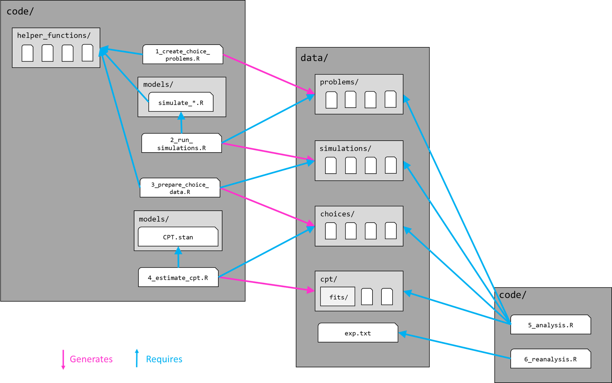

## File Descriptions

### Code

| File | Description |
|-------------------------|-----------------------------------------------|
| `1_create_choice_problems.R` | Creates all safe-risky and risky-risky choice problems underlying the simulations. Generates data sets in [data/problems/](https://github.com/linushof/sampling-strategies/tree/main/data/problems). |
| `2_run_simulations.R` | Simulates all sampling strategies on all problem sets. Generates data sets in [data/simulations/](https://github.com/linushof/sampling-strategies/tree/main/data/simulations). Main dependencies are model codes `simulate_summary.R` and `simulate_roundwise.R` in [code/models/](https://github.com/linushof/sampling-strategies/tree/main/code/models). |
| `3_prepare_choice_data.R` | Summarizes all simulations. Generates data sets in [data/choices/](https://github.com/linushof/sampling-strategies/tree/main/data/choices). |
| `4_estimate_cpt.R` | Fits CPT model for each sampling strategy on each problem set. Generates data sets in [data/cpt/](https://github.com/linushof/sampling-strategies/tree/main/data/cpt). Main dependency is the model code `CPT.stan` in [code/models/](https://github.com/linushof/sampling-strategies/tree/main/code/models). |
| `5_analysis.R` | R code for the analyses of the simulation, choice, and cpt data sets. Generates all simulation-based results and figures reported in the manuscript and supplementary materials. |
| `6_reanalysis.R` | R code for the analysis of the sampling paradigm data compiled by Wulff et al. (2018). |

### Data

|  |  |  |  |  |  |
|------------|------------|------------|------------|------------|------------|
| Subfolder | Files | Description | Repository | Release | External |
| problems/ | `SR_large.rds` | Safe-risky choice problems with larger EV differences, used for main analysis | [X] | [X] |  |
| problems/ | `SR_small.rds` | Safe-risky choice problems with smaller EV differences, used for Supplement 1 | [X] | [X] |  |
| problems/ | `RR.rds` | Risky-risky choice problems, used for Supplement 1 | [X] | [X] |  |
| problems/ | `RR2.rds` | Risky-risky choice problems, used for Supplement 2 | [X] | [X] |  |
| simulations/ | `simulation_*_**.rds.bz2` | Full simulation data for all sampling strategies with either a summary or roundwise comparison rule \* on each problem set \*\* | [X] | [X] |  |
| choices/ | `choices_*_**.rds.bz2` | Précis of all simulated trials for all sampling strategies with either a summary or roundwise comparison rule \* on each problem set \*\* | [X] | [X] |  |
| cpt/ | `cpt_choices_*_**.rds` | Précis of CPT posterior distributions for all sampling strategies with either a summary or roundwise comparison rule \* on each problem set \*\* | [X] | [X] |  |
| cpt/fits/ | `cpt_choices_*_**_set_***.rds` | Full CPT model fit (Stan data) for all sampling strategies with either a summary or roundwise comparison rule \* on each problem set \*\*, separately for each combination of the search and stopping rule \*\*\* |  | [X] |  |
|  | `exp.txt` | Data compiled by Wulff et al. (2018) |  |  | [Link](https://www.dirkwulff.org/#data) |

### File Dependencies

